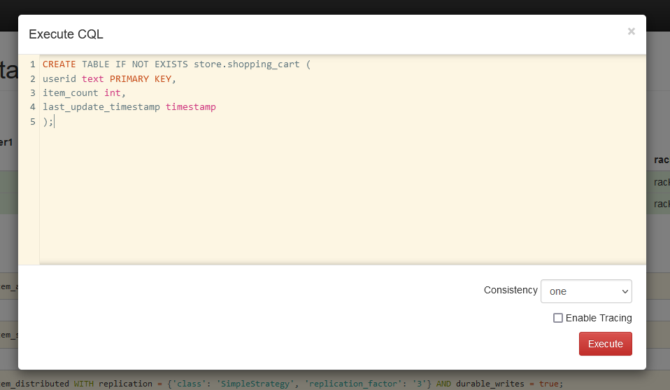
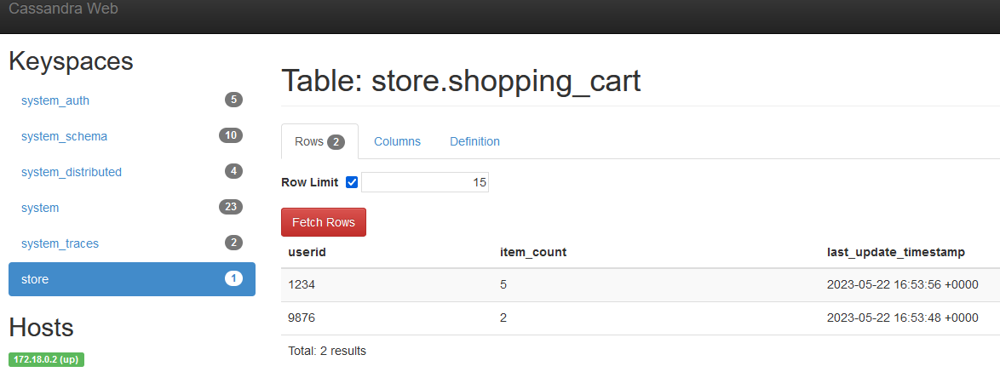

# Apache Cassandra Hands-on
In this tutorial you will learn:
1. How to set up a single Cassandra instance
2. How to define tables in Cassandra
3. How to query data in Cassandra
4. How to set up a cluster of Cassandra nodes
## Requirements
- Docker (https://docs.docker.com/get-docker)

## Step 1: Create a directory or clone the project
Create a directory named Cassandra-single and enter the directory (this will be our working directory by now). This is an optional step if you have cloned the git repository.
```sh
mkdir cassandra-single
cd cassandra-single
```

## Step 2: Define a single Cassandra node
Create a docker-compose file `docker-compose.yml` where you will define the docker container for one single instance of Cassandra.

The `docker-compose.yml` should look like this (you can use any text editor like `vi`, `nano` and `WordPad` or GUI to write the compose file). You can find an example in [docker-compose-single.yml](docker-compose-single.yml) or do `cp docker-compose-single.yml docker-compose.yml` (if you have cloned the git repo):
```yml
version: '3'

networks:
  tutorial:
    name: tutorial

services:
  cassandra:
    image: cassandra:latest
    networks:
      - tutorial
    ports:
      - "9042:9042"
```
Save the file and close the editor.

You have created a docker-compose file where you have defined one containerised service of Cassandra, using the last Cassandra image from DockerHub. The container has the port 9042 opened and mapped to the internal port 9024 of Cassandra. It is also connected to a network called *tutorial* . You will later use the network to connect more services together.

## Step 3: Let's run Cassandra
To run the cluster using Docker (using `-d` to detach the container from the terminal). The docker compose file must be named `docker-compose.yml`
```sh
docker compose up -d
```

From DockerDesktop you can see if the Container is running:


Another alternative is to use the terminal. To check the running projects in docker, you can use the following. It lists the project and the number of containers, in this case, it will show only 1 container.
```sh
docker compose ls
```

You should see something like:

```
NAME                STATUS              CONFIG FILES
cassandra           running(1)          D:\teckna\big-data-workshop\cassandra\docker-compose.yml
```

To list the containers and see more information such as their state:

```sh
docker compose ps
```

You should see something like:
```
NAME                    COMMAND                  SERVICE             STATUS              PORTS
cassandra-cassandra-1   "docker-entrypoint.s…"   cassandra           running             7000-7001/tcp, 7199/tcp, 9160/tcp, 0.0.0.0:9042->9042/tcp
```

## Step 4: Check connection to Cassandra
Let's check if we can connect by opening an interactive query shell (you may need to wait until Cassandra finishes the set-up and starts accepting connections):

```docker
docker run --rm -it --network tutorial nuvo/docker-cqlsh cqlsh cassandra 9042 --cqlversion='3.4.6' 
```

If the connection succed, it will show:

```
Connected to Test Cluster at cassandra:9042.
[cqlsh 5.0.1 | Cassandra 4.1.1 | CQL spec 3.4.6 | Native protocol v5]
Use HELP for help.
cqlsh>
```

You can type `exit` to leave.

## Step 5: Cassandra is running but we want to see the DB
You can stop Cassandra and extend the docker compose to add a new service to visualise Cassandra.

To stop and remove the containers you can use:
```sh
docker compose down
```

Let's add a new service for visualising Cassandra as in [docker-compose-gui.yml](docker-compose-gui.yml) or do `cp docker-compose-gui.yml docker-compose.yml`. Once you have the new docker-compose file, you can run it with `docker compose up -d`. If you have not removed the containers, you will observe that docker recreates the Cassandra instance. 

```yml
version: '3'

networks:
  tutorial:
    name: tutorial

services:
  cassandra:
    image: cassandra:latest
    networks:
        - tutorial
    ports:
      - "9042:9042"
    environment:
      CASSANDRA_PASSWORD: cassandra
      CASSANDRA_BROADCAST_ADDRESS: cassandra
      CASSANDRA_LISTEN_ADDRESS: cassandra
      LOCAL_JMX: "no"

  cassandra_web:
    image: basraven/cassandra-web
    networks:
      - tutorial
    ports:
      - target: 3000
        published: 8000
    environment:
      CASSANDRA_HOST: cassandra
      CASSANDRA_USER: cassandra
      CASSANDRA_PASSWORD: cassandra
    depends_on:
      - cassandra
    restart: unless-stopped
```

Now you can open the browser and see your Cassandra instance (this can take around 5 minutes to connect with Cassandra).

>http://localhost:8000


You should see something like this:


## Step 5: Load some data and query

This step can be done either from a command line or using the UI at http://localhost:8000 .

In the web UI, you can click on Execute (top-right corner).



From the command line. First we need to run the CQL shell: 

```docker
docker run --rm -it --network tutorial nuvo/docker-cqlsh cqlsh cassandra 9042 --cqlversion='3.4.6'
```

Cassandra uses keyspaces to organise the data store. Similar to namespaces in other databases. By executing the folling sentence, you can create a keyspace named `store`. This keystore has replication factor 1, meaning that there will be a single copy of the data in our database. Higher replication factor will create more copies of the data, this is particularly interesting for replicating data in a cluster.

```cql
CREATE KEYSPACE IF NOT EXISTS store WITH REPLICATION = { 'class' : 'SimpleStrategy', 'replication_factor' : '1' };
```

Cassandra is a schema-based database, thefore you need to define the data structure. In this case, a shopping cart class:

```mermaid
classDiagram
    class shopping_cart{
      +text userid
      +int item_count
      +timestamp last_update_timestamp
    }
``` 
To create this class, you can execture the following sentence:

```cql
CREATE TABLE IF NOT EXISTS store.shopping_cart (
userid text PRIMARY KEY,
item_count int,
last_update_timestamp timestamp
);
```
To add some transactions, you can use the following sentence:

```cql
INSERT INTO store.shopping_cart (userid, item_count, last_update_timestamp) VALUES ('9876', 2, toTimeStamp(now()));
INSERT INTO store.shopping_cart (userid, item_count, last_update_timestamp) VALUES ('1234', 5, toTimeStamp(now()));
```
You can visualise these rows by executing:
```cql
SELECT * FROM store.shopping_cart;
```

This should return:

```cql
 userid | item_count | last_update_timestamp
--------+------------+---------------------------------
   1234 |          5 | 2023-05-22 16:53:56.336000+0000
   9876 |          2 | 2023-05-22 16:53:48.808000+0000

(2 rows)
```

On the web UI, you can also visualise the rows.



## (Optional) Step 6: Create a cluster
**Creating a cluster of two or more nodes requires a lot of resources, it may not run on your computer.**

```yml
version: '3'

networks:
  tutorial:
    name: tutorial

services:
  cassandra1:
    image: cassandra:latest
    networks:
        - tutorial
    ports:
      - "9042:9042"
    environment:
      CASSANDRA_CLUSTER_NAME: cassandra-cluster
      CASSANDRA_PASSWORD: cassandra
      CASSANDRA_PASSWORD_SEEDER: "yes"
      LOCAL_JMX: "no"
  
  cassandra2:
    image: cassandra:latest
    networks:
        - tutorial
    ports:
      - target: 9042
        published: 9043
    environment:
      CASSANDRA_CLUSTER_NAME: cassandra-cluster
      CASSANDRA_PASSWORD: cassandra
      CASSANDRA_SEEDS: cassandra1 
      LOCAL_JMX: "no"
    depends_on:
      - cassandra1

  cassandra_web:
    image: basraven/cassandra-web
    networks:
      - tutorial
    ports:
      - target: 3000
        published: 8000
    environment:
      CASSANDRA_HOST: cassandra1
      CASSANDRA_USER: cassandra
      CASSANDRA_PASSWORD: cassandra
    depends_on:
      - cassandra1
      - cassandra2
    restart: unless-stopped
```

## (Optional) Step 7: Visualise the cluster

Now you can open the browser and see your Cassandra instance. This time you will see two nodes.

>http://localhost:8000

You should now see:


## Step 8: Playground
## Trobleshooting
### Checking the logs
To check the logs of a container an see what is happending or the errors use:
```sh
docker compose logs <container-name>
```

### Default docker IP address
In windows you can check the address of your docker engine by opening Docker Desktop and going to settings. There go to Resources > Network