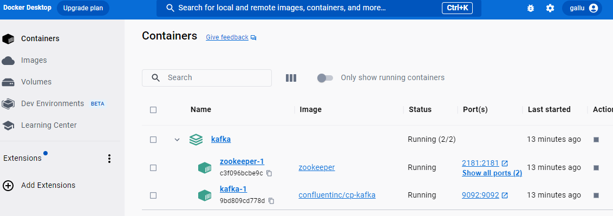

# Apache Kafka Hands-on
In this tutorial you will learn:
1. How to set up a single Kafka instance
2. How to handle data in Kafka
4. How to set up a cluster of Kafka nodes
## Requirements
- Docker (https://docs.docker.com/get-docker)

## Step 1: Create a directory or clone the project
Create a directory named kafka and enter the directory (this will be your working directory). If you have cloned this git repository, you can skip this step.
```sh
mkdir kafka
cd kafka
```

## Step 2: Define a single Kafka node
Create a docker-compose file `docker-compose.yml` where you will define the docker container for one single instance of Kafka.

Apacha Kafka depends on Zookeeper to manage the running jobs.

The `docker-compose.yml` should look like this (you can use any text editor like `vi`, `nano` and `WordPad` or GUI to write the compose file). You can find an example in [docker-compose-single.yml](docker-compose-single.yml) or do `cp docker-compose-single.yml docker-compose.yml` (if you have cloned the git repo):
```yml
version: '3'

networks:
  tutorial:
    name: tutorial

services:
  zookeeper:
    image: zookeeper
    networks:
      - tutorial
    ports:
      - target: 2181
        published: 2181
    environment:
      ZOOKEEPER_CLIENT_PORT: 2181
      ALLOW_ANONYMOUS_LOGIN: "yes"

  kafka1:
    image: confluentinc/cp-kafka
    depends_on:
      - zookeeper
    networks:
      - tutorial
    ports:
      - "9092:9092"
      - "19092:19092"
    environment:
      KAFKA_BROKER_ID: 1
      ALLOW_PLAINTEXT_LISTENER: "yes"
      KAFKA_LISTENER_SECURITY_PROTOCOL_MAP: INTERNAL:PLAINTEXT,HOST:PLAINTEXT
      KAFKA_LISTENERS: INTERNAL://0.0.0.0:19092,HOST://0.0.0.0:9092
      KAFKA_ADVERTISED_LISTENERS: HOST://localhost:9092,INTERNAL://kafka1:19092
      KAFKA_INTER_BROKER_LISTENER_NAME: INTERNAL
      KAFKA_ZOOKEEPER_CONNECT: zookeeper:2181
      KAFKA_AUTO_CREATE_TOPICS_ENABLE: 'true'
      KAFKA_OFFSETS_TOPIC_REPLICATION_FACTOR: 1
```
Save the file and close the editor.

You have created a docker-compose file where you have defined one containerised service of Kafka, using the last Kafka image from DockerHub. The container has the port 27027 opened and mapped to the internal port 27027 of Kafka. It is also connected to a network called *tutorial* . You will later use the network to connect more services together.

## Step 3: Let's run Kafka
To run the Kafka instance using Docker (using `-d` to detach the container from the terminal). The docker compose file must be named `docker-compose.yml`
```sh
docker compose up -d
```

From DockerDesktop you can see if the container is running:


Another alternative is to use the terminal. To check the running projects in docker, you can use the following. It lists the project and the number of containers, in this case, it will show only 1 container.
```sh
docker compose ls
```

You should see something like:

```
NAME                STATUS              CONFIG FILES
kafka               running(2)          D:\teckna\big-data-workshop\kafka\docker-compose.yml
```

To list the containers and see more information such as their state:

```sh
docker compose ps
```

You should see something like:
```
NAME                IMAGE                   COMMAND                  SERVICE             CREATED             STATUS              PORTS
kafka-kafka-1       confluentinc/cp-kafka   "/etc/confluent/dock…"   kafka               11 minutes ago      Up 11 minutes       0.0.0.0:9092->9092/tcp, 0.0.0.0:19092->19092/tcp
kafka-zookeeper-1   zookeeper               "/docker-entrypoint.…"   zookeeper           11 minutes ago      Up 11 minutes       2888/tcp, 3888/tcp, 0.0.0.0:2181->2181/tcp, 8080/tcp
```

## Step 4: Check connection to Kafka
Let's check if we can connect by opening an interactive shell (you may need to wait until Kafka finishes the set-up and starts accepting connections):

First, to create a topic:
```docker
docker exec -it kafka-kafka-1 /bin/kafka-topics --create --replication-factor 1 --partitions 1 --topic test --bootstrap-server kafka:19092
```
Then, you will need to open two terminals, one for producing messages and other for consuming.

To produce messages:
```docker
docker exec -it kafka-kafka-1 /bin/kafka-console-producer --topic test --bootstrap-server kafka:19092
```

To consume messages (it can take a couple of minutes until it starts consuming messages):
```docker
docker exec -it kafka-kafka-1 /bin/kafka-console-consumer --topic test  --bootstrap-server kafka:19092 --from-beginning
```

You can type `Ctrl+C` to leave.


## (Optional) Step 6: Create a cluster
**Creating a cluster of two or more nodes requires a lot of resources, it may not run on your computer.**

For this you can use the following docker-compose or do `cp docker-compose-cluster.yml docker-compose.yml` (if you have cloned the git repo):

```yml
version: '3'

networks:
  tutorial:
    name: tutorial

services:
  zookeeper:
    image: zookeeper
    networks:
      - tutorial
    ports:
      - target: 2181
        published: 2181
    environment:
      ZOOKEEPER_CLIENT_PORT: 2181
      ALLOW_ANONYMOUS_LOGIN: "yes"

  kafka1:
    image: confluentinc/cp-kafka
    depends_on:
      - zookeeper
    networks:
      - tutorial
    ports:
      - "9092:9092"
      - "19092:19092"
    environment:
      KAFKA_BROKER_ID: 1
      ALLOW_PLAINTEXT_LISTENER: "yes"
      KAFKA_LISTENER_SECURITY_PROTOCOL_MAP: INTERNAL:PLAINTEXT,HOST:PLAINTEXT
      KAFKA_LISTENERS: INTERNAL://0.0.0.0:19092,HOST://0.0.0.0:9092
      KAFKA_ADVERTISED_LISTENERS: HOST://localhost:9092,INTERNAL://kafka1:19092
      KAFKA_INTER_BROKER_LISTENER_NAME: INTERNAL
      KAFKA_ZOOKEEPER_CONNECT: zookeeper:2181
      KAFKA_AUTO_CREATE_TOPICS_ENABLE: 'true'
      KAFKA_OFFSETS_TOPIC_REPLICATION_FACTOR: 1

  kafka2:
    image: confluentinc/cp-kafka
    depends_on:
      - zookeeper
      - kafka1
    networks:
      - tutorial
    ports:
      - "9292:9292"
      - "29092:29092"
    environment:
      KAFKA_BROKER_ID: 2
      ALLOW_PLAINTEXT_LISTENER: "yes"
      KAFKA_LISTENER_SECURITY_PROTOCOL_MAP: INTERNAL:PLAINTEXT,HOST:PLAINTEXT
      KAFKA_LISTENERS: INTERNAL://0.0.0.0:29092,HOST://0.0.0.0:9292
      KAFKA_ADVERTISED_LISTENERS: HOST://localhost:9292,INTERNAL://kafka1:29092
      KAFKA_INTER_BROKER_LISTENER_NAME: INTERNAL
      KAFKA_ZOOKEEPER_CONNECT: zookeeper:2181
      KAFKA_AUTO_CREATE_TOPICS_ENABLE: 'true'
      KAFKA_OFFSETS_TOPIC_REPLICATION_FACTOR: 1
```

Once the instances are running, you can send messages and consume messages like before:

```docker
docker exec -it kafka-kafka1-1 /bin/kafka-topics --create --replication-factor 1 --partitions 1 --topic test --bootstrap-server kafka1:19092

docker exec -it kafka-kafka1-1 /bin/kafka-console-producer --topic test --bootstrap-server kafka1:19092

docker exec -it kafka-kafka2-1 /bin/kafka-console-consumer --topic test  --bootstrap-server kafka2:29092 --from-beginning
```


## Step 7: Playground

## Trobleshooting
### Checking the logs
To check the logs of a container an see what is happending or the errors use:
```sh
docker compose logs <container-name>
```

### Default docker IP address
In windows you can check the address of your docker engine by opening Docker Desktop and going to settings. There go to Resources > Network

## Addition resources
This resources can help you to expand your knowledge on Apache Kafka:
- https://kafka.apache.org/documentation.html

An sql-like database build on top of Apache Kafka:
- KsqlDB: https://ksqldb.io/